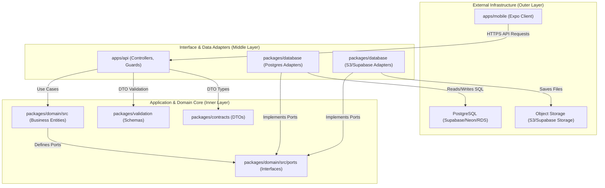
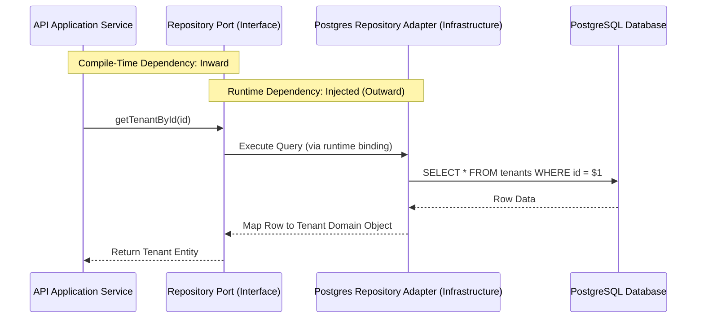
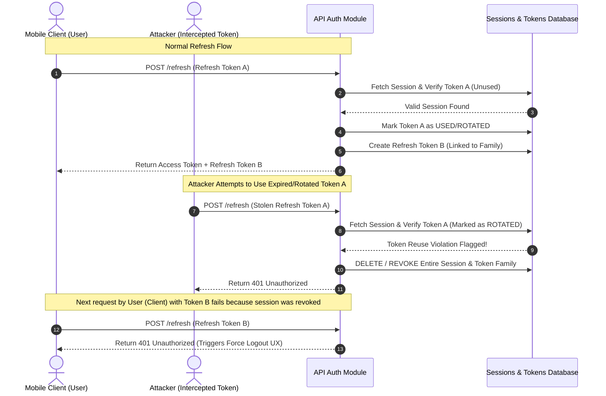
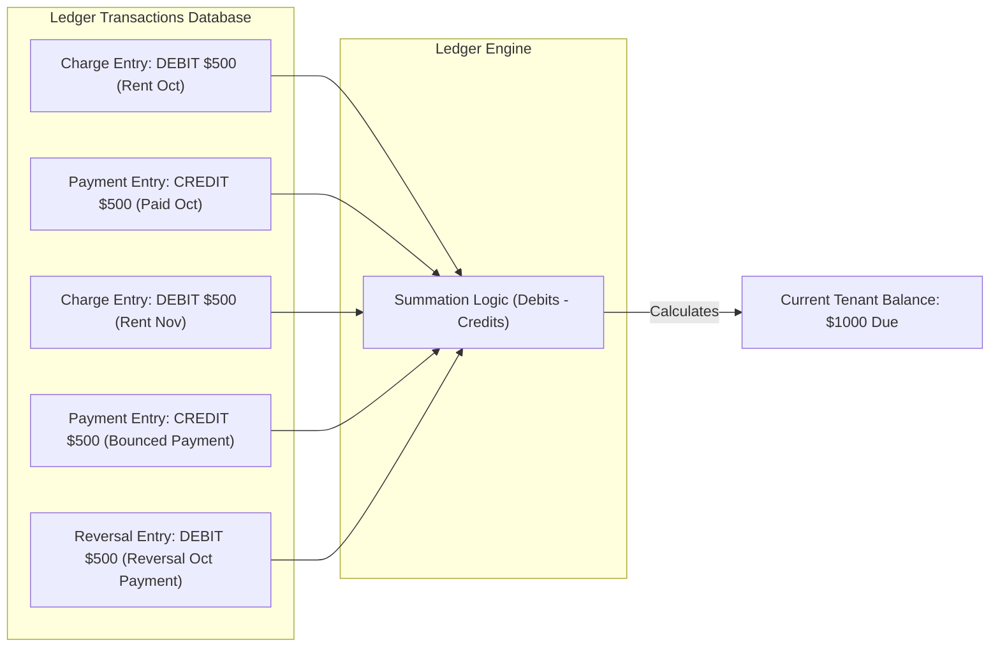
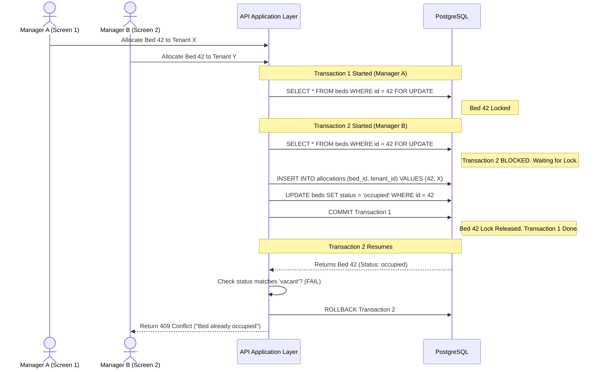

# M SQUARE — SYSTEM ARCHITECTURE SPECIFICATION

This document outlines the architectural blueprint, design patterns, and systemic data flows for the **M Square PG & Hostel Management System**.

---

## 1. Architectural Overview

M Square is built using a **Clean Architecture (Hexagonal Architecture / Ports & Adapters)** model organized inside a monorepo. The core goal of this architecture is **Infrastructure Decoupling**, ensuring that business rules are entirely independent of third-party vendors (like Supabase), frameworks (React Native, Expo, NestJS), and databases (PostgreSQL, Neon, AWS RDS).

### Key Architectural Pillars:
1.  **Inward Dependency Flow**: Dependencies flow strictly from outer delivery mechanisms (Mobile App, HTTP API) toward stable business abstractions (Domain Entities). The Domain layer must never import files from any other package.
2.  **Dependency Inversion**: Outer layers (e.g. database adapters) implement interfaces (Ports) defined in the inner layers (Domain/Application).
3.  **Infrastructure Ignorance**: The core business logic operates as if the database is in-memory. All persistence operations are routed through abstract interfaces.
4.  **Transactional Integrity**: Critical actions (bookings, checkouts, payments) utilize atomic database transactions managed at the application service boundary.

---

## 2. Layered Architecture

The system is split into three main concentric circles of responsibility:

---

## 3. Dependency Inversion in Action

To prevent Supabase or PostgreSQL code from leaking into the core application, all database queries are hidden behind **Repository Ports**. 

### Compile-time Dependency vs. Run-time Execution Flow:
The diagram below illustrates how compilation dependencies flow inward, while execution control flows outward to database infrastructure:

---

## 4. Custom Authentication & Token Security Architecture

Supabase Auth is bypassed. The application manages sessions and tokens internally, utilizing `Argon2id` for credential storage, JWTs for short-lived access tokens, and a database-backed refresh token rotation family database schema.

### Token Rotation & Reuse Detection Sequence
If an attacker steals a refresh token, they will try to reuse it. The system detects this immediately by checking if the token has already been marked as rotated, prompting session invalidation:

---

## 5. Ledger-Based Financial Architecture

Balances are never stored as mutable properties that are direct-edited. Instead, the application implements a double-entry ledger database pattern.

### Balance Calculation & Correction Flow:
1.  **Rent Generation**: Creates a `DEBIT` record (charge).
2.  **Tenant Payment**: Creates a `CREDIT` record (payment).
3.  **Balance Derivation**: The system sums the ledger records (`charges - payments = balance`).
4.  **Payment Reversal**: If a check bounces, the payment is **never** deleted. Instead, a `REVERSAL` debit entry is written, preserving historical auditability.

---

## 6. Concurrency & Allocation Architecture

PG applications suffer from double-booking risks if two managers try to allocate the same bed simultaneously. 

### Database-Level Concurrency Control
Rather than validating vacancy in Node memory, M Square employs row-level locks on the `beds` database table within the booking transaction boundary.

---

## 7. Architecture Compliance Checklist

To preserve this architecture during execution, developers must review new features against the following requirements:
*   [ ] **Domain Isolation**: Code in `packages/domain` must not import any modules from other packages or framework libraries.
*   [ ] **No Direct SQL**: Controllers and API services must not execute raw SQL or call knex/prisma/supabase clients. All queries must route through the declared `Repository` interface.
*   [ ] **Private File Access**: The frontend must never have access to raw bucket URLs. Documents must be retrieved via short-lived signed URLs generated by the `StorageProvider`.
*   [ ] **Atomicity**: Features modifying multiple entities (e.g. allocations, balances, states) must wrap changes inside a database transaction adapter.
