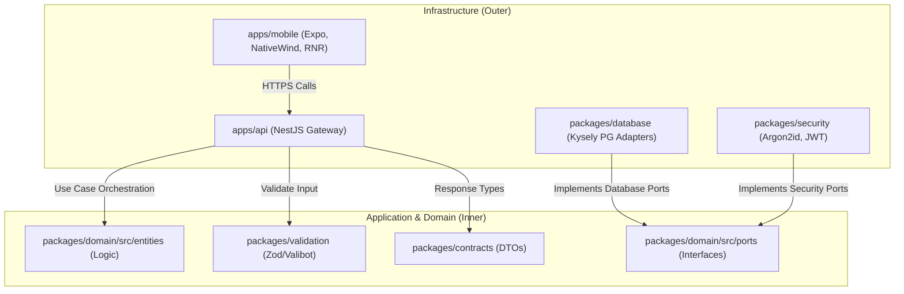
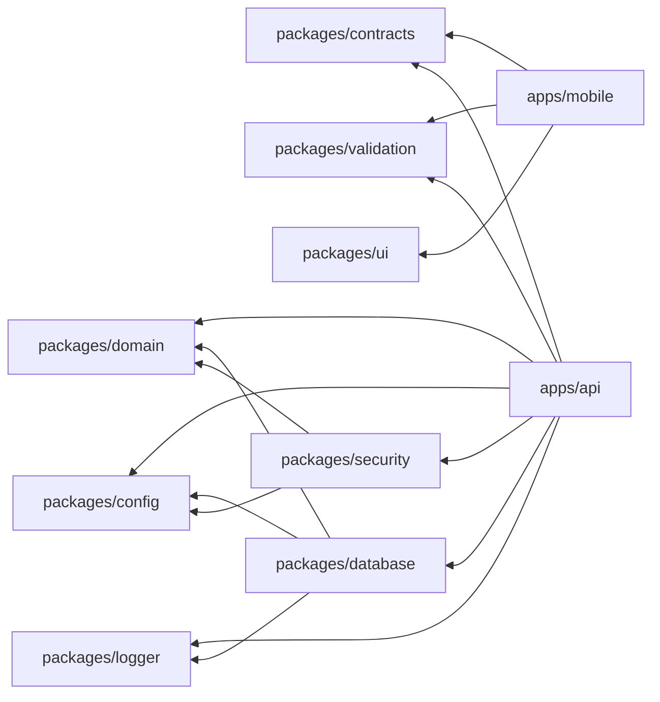

# M SQUARE — TECHNICAL ARCHITECTURE & ROADMAP

This document outlines the finalized technical architecture, dependency schemas, and database designs incorporating all **Locked Architectural Decisions** approved by the Principal Software Architect.

---

## 1. Core Architectural Specifications

### A. Final Architecture (Clean Architecture / Hexagonal)
The project is built on **Ports and Adapters** concepts. Domain models, validations, and ports are isolated from infrastructure implementations (Kysely database client, NestJS REST API, and Expo UI client).



### B. Final Monorepo Structure
We implement a unified monorepo governed by `pnpm` workspaces and `Turborepo`:

```text
m-square/
├── apps/
│   ├── api/                            # NestJS Application API
│   └── mobile/                         # Expo React Native UI Client
├── packages/
│   ├── config/                         # Env loading and validator (Zod)
│   ├── contracts/                      # DTO schemas and API response types
│   ├── database/                       # Kysely connection and SQL repositories
│   ├── domain/                         # Pure business logic models and Ports
│   ├── logger/                         # Structured Winston/Pino logger package
│   ├── security/                       # Argon2id, JWT, and session tools
│   ├── ui/                             # React Native Reusables components (styled with NativeWind)
│   └── validation/                     # API payload Zod schemas
└── infrastructure/
    ├── database/                       # Migrations (001_initial.sql, etc.)
    └── docker/                         # Local PostgreSQL dev environment container
```

### C. Dependency Graph
To enforce modular boundaries, dependencies flow strictly outward-in. Cyclic dependencies are prevented:



---

## 2. Abstraction & Interface Specifications

### D. Database Abstraction Design (Kysely)
*   We use **Kysely** query builder over raw PostgreSQL drivers for type-safe query execution.
*   **No ORM entities leak** to the domain. Results from queries are explicitly mapped into pure Domain Entity objects (e.g. `Tenant` class) within database adapters.
*   **Mandatory Organization Isolation**: Repository methods require `organizationId` as a parameter to block IDOR attacks at the data-access boundary:

```typescript
// packages/domain/src/ports/tenant.repository.ts
export interface TenantRepository {
  findById(id: string, organizationId: string): Promise<Tenant | null>;
  create(tenant: Tenant, organizationId: string): Promise<Tenant>;
  update(tenant: Tenant, organizationId: string): Promise<Tenant>;
  list(options: PaginationQuery, organizationId: string): Promise<PagedResult<Tenant>>;
}
```

### E. Authentication Architecture
1.  **Password Hashing**: Backend hashes credentials using `Argon2id` (using the native `argon2` module). Plaintext passwords never persist or log.
2.  **Access Token**: 15-minute expiry JWT, verifying the client via symmetric JWT secret keys.
3.  **Refresh Token**: Cryptographically random 32-byte string. Inserted into the database as a SHA-256 hash (`refresh_tokens` table) to protect against database theft.
4.  **Rotation & Revocation**:
    *   Refreshing an access token rotates both tokens (Access + Refresh).
    *   If a previously rotated token is presented, the system flags a breach and revokes all active tokens in that session family (`session_id`).

### F. Authorization & Data Isolation
*   **RBAC**: NestJS guards inspect user permissions (`@RequirePermissions('tenant.checkout')`).
*   **Multi-Tenant Isolation**: Request interceptors extract `organization_id` from the JWT claims and inject it into request scopes. Every service and repository adapter enforces `organization_id` match.

### G. Storage Abstraction
A core interface decouples file management from cloud providers:

```typescript
// packages/domain/src/ports/storage.provider.ts
export interface StorageProvider {
  upload(key: string, file: Buffer, mimeType: string): Promise<string>; // Returns path/key
  getSignedUrl(key: string, expirySeconds: number): Promise<string>;
  delete(key: string): Promise<void>;
}
```
*   **Dev Adapter**: `LocalStorageProvider` (saves to local workspace directory for development).
*   **Remote Adapter**: `SupabaseStorageProvider` (interacts with Supabase Object Storage bucket behind the interface).

### H. API / Swagger Architecture
*   Standardized NestJS `@nestjs/swagger` module configuration.
*   Swagger schema configurations auto-generated from DTO classes.
*   Every endpoint contains explicit decorators detailing `@ApiOperation`, `@ApiBearerAuth`, `@ApiResponse` (for success and specific error codes), and pagination metadata templates.

### I. UI & Shadcn-Compatible Architecture
*   **Expo / React Native**: Built using Expo Router (file-based navigation).
*   **Styling**: **NativeWind** (Tailwind configuration mapping custom color tokens for dark mode compatibility).
*   **Components**: Built using **React Native Reusables (RNR)** primitive concepts, exposing clean, accessible primitives styled to look identical to Web `shadcn/ui` layouts.

---

## 3. Operations & Lifecycle Quality Standards

### J. Development Workflow
Every feature is implemented using a strict sequence:
1.  **Draft Feature Spec**: Formulate business scope and DB changes.
2.  **Database Migration**: Write reproducible, non-destructive SQL files.
3.  **Domain Port**: Expose repository interfaces in `packages/domain`.
4.  **Database Adapter**: Implement queries using Kysely in `packages/database`.
5.  **Service & Controller**: Write NestJS endpoint handler logic in `apps/api`.
6.  **Tests**: Unit, Integration, and Security test validation.
7.  **Swagger UI**: Confirm contract matches execution.
8.  **UI Integration**: Build Expo screen widgets using the API Client.

### K. Testing Strategy
*   **Unit Tests**: Vitest/Jest tests for business rules (e.g. dynamic ledger summation, token validation).
*   **Integration Tests**: Run Kysely queries against a test-scoped PostgreSQL docker container.
*   **Security Tests**: Mock unauthorized token reuse and cross-organization IDOR queries to verify `403 Forbidden` responses.
*   **Workflow Tests**: Automation simulating a tenant's lifecycle (Check-in → Bed Occupied → Rent Invoice → Ledger Payment → Checkout → Bed Vacant).

### L. Security Strategy
*   **Lockout Policy**: Block login requests after 5 sequential failures for 15 minutes.
*   **Input Cleansing**: Parametrization of all SQL queries to prevent SQL injections; schema validation on all inputs (Zod).
*   **Log Redaction**: Global filters mask variables containing `password`, `token`, `cardNumber`, or PII email addresses.

---

## 4. Milestone 1 Scope (Foundation Setup)

Milestone 1 will bootstrap the codebase framework, setting up core configurations:

### A. Created Workspace Foundations
*   Root configuration files (`package.json`, `pnpm-workspace.yaml`, `turbo.json`, `tsconfig.base.json`, `.env.example`).
*   Establish directory skeletons for applications and shared packages.
*   Setup Local Database container: Docker compose file (`infrastructure/docker/docker-compose.yml`) deploying PostgreSQL.

### B. Core Shared Packages
*   **packages/config**: Zod validator ensuring application fails to boot if `DATABASE_URL` or `JWT_SECRET` is missing.
*   **packages/logger**: Winston/Pino logger setup mapping logs to standard output in production and local dev.
*   **packages/security**: Hashing functions (Argon2id configuration wrappers) and JWT sign/verify utilities.

---

## 5. Verification Plan (Milestone 1)

### Automated Tests
*   `pnpm run test` executes basic config loader checks.

### Manual Verification
*   Execute `docker-compose up -d` to verify local PostgreSQL boots.
*   Run validation test scripts ensuring the app exits with status code 1 if required environment variables are omitted on startup.
